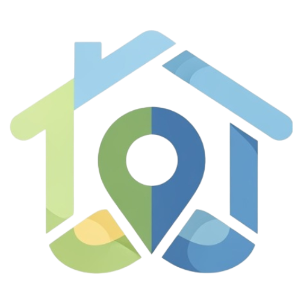

  
  

<h1 align="center">InfoBairro</h1>

  <strong>Inteligência Urbana e Georreferenciamento em Camaçari</strong>

  
  
 

---

## 📖 1. Descrição do Produto/Serviço
O **InfoBairro** é uma plataforma web georreferenciada desenvolvida em **C# (ASP.NET Core MVC)**. O sistema permite que os moradores de Camaçari visualizem mapas interativos e participem de um painel de avaliações, permitindo o compartilhamento de dados reais sobre infraestrutura e serviços locais.

## ⚠️ 2. Diagnóstico do Problema
Informações oficiais sobre bairros costumam ser genéricas. Moradores enfrentam dificuldades para encontrar relatos atualizados sobre a qualidade de vida, o que gera incerteza em decisões críticas como moradia ou abertura de comércios.

## 💡 3. Diferencial Inovador
O projeto utiliza uma estrutura de **Data Intelligence**. Diferente de redes sociais, aqui os relatos são vinculados a coordenadas geográficas e moderados, transformando comentários em relatórios de tendência urbana.

---

## 🛠️ 4. Recursos Tecnológicos

### ⚙️ Backend & Frontend
* **Linguagem:** C# com framework ASP.NET Core MVC.
* **Interface:** Razor Pages, HTML5, CSS3, JavaScript e **Bootstrap**.
* **Dados:** Entity Framework Core (ORM) com banco **MariaDB**.

### 🏗️ Arquitetura MVC
| Camada | Função |
| :--- | :--- |
| **Model** | Lógica de dados (Bairros, Usuários, Avaliações). |
| **View** | Apresentação visual e interação com o cidadão. |
| **Controller** | Gerenciamento de requisições e fluxo de dados. |

---

## 📋 5. Requisitos da Solução

### ✅ Requisitos Funcionais
* **RF05:** Registro de avaliação (Segurança, Mobilidade, Limpeza e Infraestrutura).
* **RF06:** Exibição de marcadores georreferenciados no mapa.
* **RF08:** Painel administrativo para moderação de conteúdo.

### 🔒 Regras de Negócio
* **RN01 (LGPD):** Exportação de dados para parceiros B2B é 100% anonimizada.
* **RN02 (Filtro):** Sistema de bloqueio automático de palavras ofensivas.
* **RN03 (Curadoria):** Relatos só aparecem no mapa após aprovação do moderador.

---

## 📅 6. Cronograma e Roadmap
* **2025.1:** Design no Figma, Diagramas e Proposta de Valor.
* **2025.2:** Desenvolvimento Back-end e Banco de Dados.
* **2026.1:** Plano de Projeto, Refinamento de Código e Pitch Final.

---

## 👥 7. Persona e Estratégia
**Público:** Moradores e visitantes de Camaçari.  
**Comercial:** Venda de Dashboards analíticos para o setor imobiliário, utilizando dados agregados e tendências de mercado.

---

  <strong>Projeto desenvolvido no SENAI Camaçari • 2026</strong> 
  Arthur Michelângelo • Enya Arruda • Gabriel Oliveira • Leandro Rivas • Nicolly Brito

